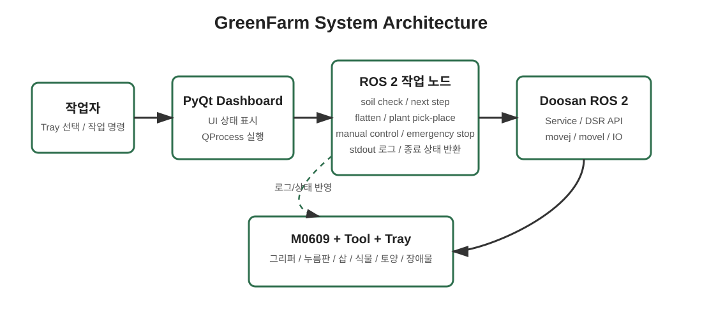
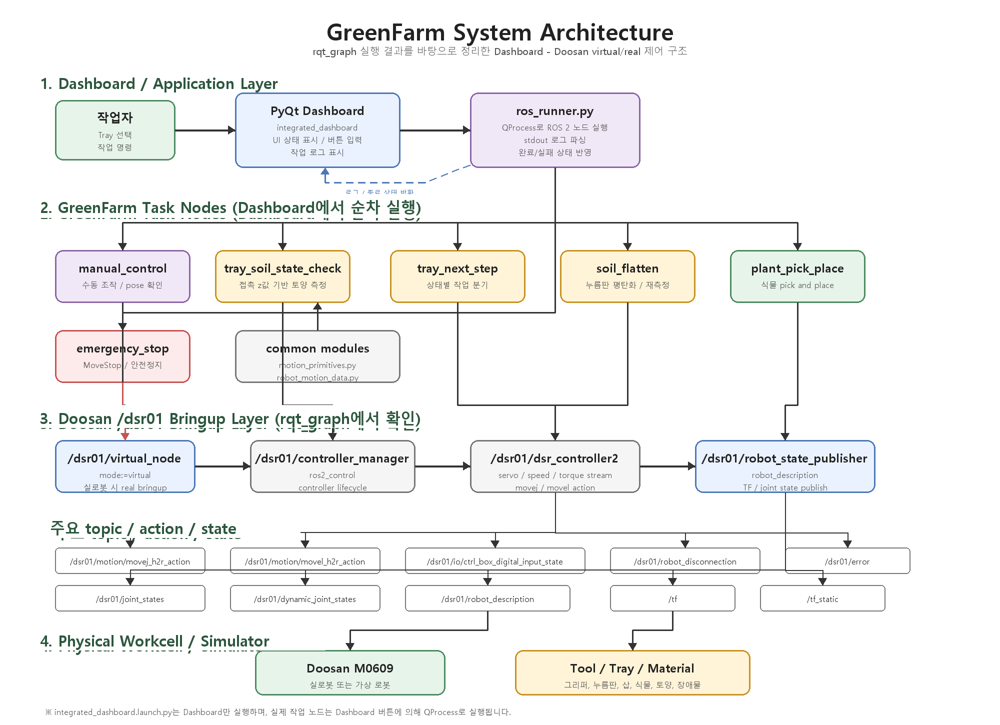
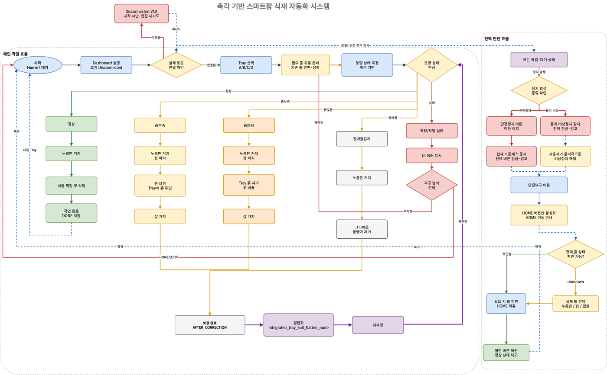

# 촉각 기반 스마트팜 식재 자동화 시스템 (GreenFarm)

Doosan M0609 협동로봇과 PyQt Dashboard를 이용해 스마트팜 식재 작업을 자동화한 ROS 2 프로젝트입니다.
카메라 대신 로봇의 접촉 기반 측정값을 활용해 트레이의 토양 상태를 판단하고, 상태에 따라 흙 보충, 흙 제거, 평탄화, 장애물 제거, 식물 식재 작업을 수행합니다.

▶ [1분 시연 영상](https://drive.google.com/file/d/1p9_dyek6e7o9HDlVhM4NHQk2XoZrypt7/view)

---

## 1. 시스템 설계 및 플로우 차트

프로젝트의 전체 실행 구조와 작업 흐름입니다.

### 1-1. 시스템 설계도 (System Architecture)

#### 간단 구조도

<p align="center">
  
</p>

*설명: Dashboard가 사용자 입력을 받고, 필요한 ROS 2 작업 노드를 QProcess로 실행합니다. 작업 노드는 Doosan ROS 2 Service 및 DSR API를 통해 M0609 협동로봇과 도구를 제어합니다.*

#### 상세 구조도

<p align="center">
  
</p>

*설명: launch는 Dashboard만 실행하며, 실제 작업 노드는 Dashboard의 버튼/상태에 따라 순차적으로 실행됩니다. Doosan 계층은 virtual mode에서 rqt_graph로 확인한 `/dsr01` bringup 구조를 바탕으로 정리했습니다.*

### 1-2. 플로우 차트 (Flow Chart)

<p align="center">
  
</p>

*설명: Dashboard 실행 후 로봇 연결 확인, 트레이 선택, 토양 상태 측정, 상태별 작업 분기, 평탄화, 재측정, 안전 정지 및 복구 흐름을 나타냅니다. 원본 이미지는 `./images/greenfarm_flow_chart.png`에 보관되어 있습니다.*

---

## 2. 운영체제 환경 (OS Environment)

이 프로젝트는 다음 환경에서 개발 및 실행하였습니다.

* **OS:** Ubuntu 22.04 LTS
* **ROS Version:** ROS 2 Humble
* **Language:** Python 3.10
* **UI Framework:** PyQt5
* **Robot SDK / Driver:** Doosan ROS 2, DSR_ROBOT2, dsr_common2
* **Build Tool:** colcon

---

## 3. 사용 장비 목록 (Hardware List)

프로젝트에 사용한 주요 하드웨어 장비입니다.

| 장비명 | 수량 | 비고 |
|:---:|:---:|:---|
| Doosan M0609 협동로봇 | 1 | 식재 및 토양 보정 작업 수행 |
| Doosan 로봇 컨트롤러 | 1 | 로봇 제어 및 ROS 2 통신 |
| ROS 2 실행 PC | 1 | Dashboard 및 ROS 2 노드 실행 |
| 그리퍼 | 1 | 식물, 돌멩이, 누름판, 삽 파지 |
| 누름판 | 1 | 토양 평탄화 작업 |
| 삽 | 1 | 흙 보충 및 흙 제거 작업 |
| 식재 트레이 | 4 | A/B/C/D 트레이 선택 작업 |
| 모종/식물 | 3개 이상 | 식물 pick and place 시나리오 |
| 토양 대체재 | 1식 | 흙 부족/정상/흙 많음 상태 구성 |
| 장애물 샘플 | 1식 | 돌멩이 제거 시나리오 |

---

## 4. 의존성 (Dependencies)

프로젝트 실행에 필요한 ROS 2 패키지와 Python 패키지입니다.

### ROS 2 / Doosan 패키지

* `rclpy`
* `launch`
* `launch_ros`
* `dsr_common2`
* `dsr_bringup2`
* `DSR_ROBOT2`

### Python 패키지 (`requirements.txt`)

```txt
PyQt5
```

`package.xml`에는 ROS 2 실행 의존성이 정의되어 있으며, UI 실행을 위해 `python3-pyqt5`가 필요합니다.

---

## 5. 실행 순서 (Usage Guide)

프로젝트를 실행하기 위한 순서입니다. 터미널 명령어를 순서대로 입력합니다.

### Step 1. ROS 2 환경 설정

```bash
source /opt/ros/humble/setup.bash
```

### Step 2. 워크스페이스 빌드 및 source

```bash
cd ~/ws_cobot_pjt/ws_cobot1
colcon build --symlink-install
source install/setup.bash
```

### Step 3. Doosan 로봇 bringup 실행

```bash
ros2 launch dsr_bringup2 dsr_bringup2_rviz.launch.py mode:=real host:=192.168.1.100 port:=12345 model:=m0609
```

### Step 4. 통합 Dashboard 실행

```bash
ros2 launch robot_tests integrated_dashboard.launch.py
```

`integrated_dashboard.launch.py`는 PyQt Dashboard만 실행합니다. 이후 실제 작업 노드는 Dashboard에서 선택한 버튼과 상태에 따라 QProcess로 순차 실행됩니다.

### Step 5. Dashboard 기반 작업 실행

Dashboard에서 다음 기능을 선택해 실행합니다.

* 로봇 연결 상태 확인
* Tray A/B/C/D 선택
* 토양 상태 측정
* 상태별 다음 작업 실행
  * 흙 부족: 흙 보충
  * 정상: 식물 식재
  * 흙 많음: 흙 제거
  * 장애물 후보: 돌멩이 제거
* 평탄화 및 재측정
* 긴급정지, 안전복구, HOME 복귀

### Step 6. 개별 노드 실행 예시 (디버깅용)

Dashboard 없이 단일 기능을 확인할 때는 아래 명령어를 사용할 수 있습니다.

```bash
ros2 run robot_tests go_home_test
ros2 run robot_tests integrated_manual_control_node
ros2 run robot_tests integrated_tray_soil_state_check_node
ros2 run robot_tests integrated_tray_next_step_node
ros2 run robot_tests integrated_tray_soil_flatten_node
ros2 run robot_tests integrated_plant_pick_and_place_node
ros2 run robot_tests integrated_emergency_stop_node
```

보조 테스트 노드 예시는 아래와 같습니다.

```bash
ros2 run robot_tests press_plate_pickup_node
ros2 run robot_tests press_plate_putdown_node
ros2 run robot_tests shovel_pickup_node
ros2 run robot_tests shovel_putdown_node
ros2 run robot_tests tray_soil_add_node
ros2 run robot_tests tray_soil_remove_node
ros2 run robot_tests tray_soil_flatten_node
ros2 run robot_tests tray_rock_remove_node
ros2 run robot_tests simple_compliance_down_up_test
```

---

## 참고: 주요 코드 구성

| 파일 | 역할 |
|:---|:---|
| `launch/integrated_dashboard.launch.py` | 통합 Dashboard 실행 launch 파일 |
| `robot_tests/integrated/main.py` | Dashboard 실행 진입점 |
| `robot_tests/integrated/dashboard_app.py` | PyQt Dashboard UI 및 이벤트 처리 |
| `robot_tests/integrated/ros_runner.py` | Dashboard에서 ROS 2 작업 노드 실행 |
| `robot_tests/robot_motion_data.py` | 좌표, 조인트, Tool/TCP, 토양 기준값 관리 |
| `robot_tests/motion_primitives.py` | movej, movel, gripper, HOME 복귀 공통 함수 |
| `robot_tests/integrated_tray_soil_state_check_node.py` | 토양 상태 측정 및 판정 |
| `robot_tests/integrated_tray_next_step_node.py` | 토양 상태별 다음 작업 분기 |
| `robot_tests/integrated_tray_soil_flatten_node.py` | 평탄화 작업 |
| `robot_tests/integrated_plant_pick_and_place_node.py` | 식물 pick and place 작업 |
| `robot_tests/integrated_emergency_stop_node.py` | 긴급정지 실행 |
